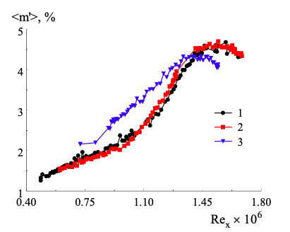
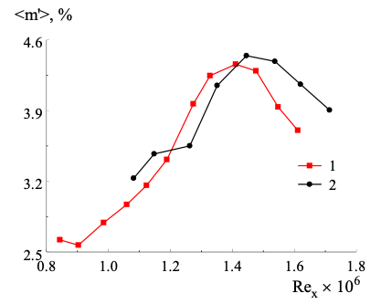

```{r setup, include=FALSE}
knitr::opts_chunk$set(echo = TRUE)
```


# Виды анализа данных

### 1. Механистический анализ

**Цель** данного вида анализа состоит в определении конкретных измнений в переменных, которые влекут за собой точные изменения в других переменных. 

 Механистический анализ применяется в следующих случаях:
 
 - Простые случаи;
 
 - Ситуации, которые хорошо моделируются детерминированными уравнениями;
 
 - В физических и инженерных науках.
 
Рассмотрим пример исследования, проведенного с помощью механистического анализа:

**УДК 532.526**

**DOI 10.25205/2541-9447-2021-16-1-44-52**

*В.Л.Кочарин ,Н.В.Семёнов ,А.Д.Косинов ,А.А.Яцких*

Институт теоретической и прикладной механики им С. А. Христиановича СО РАН Новосибирск, Россия

##### *Экспериментальное исследование влияния единичного числа Рейнольдса на положение ламинарно-турбулентного перехода на крыле с дозвуковой передней кромкой при числе Маха 2*

[Ссылка на статью](https://journals.nsu.ru/upload/iblock/996/0720_SJP_21T16V1_p44_p52.pdf)

В данной статье проведены экспериментальные исследования влияния единичного числа Рейнольдса на ламинарно-турбулентный переход в сверхзвуковом пограничном слое скользящего крыла с дозвуковой передней кромкой при числе Маха 2. Полученные термоанемометрические данные показали, что ламинарно-турбулентный переход в сверхзвуковом пограничном слое скользящего крыла с дозвуковой передней кромкой наступает раньше, чем на модели со сверхзвуковой передней кромкой при одних и тех же параметрах набегающего потока. Показано, что изменение единичного числа Рейнольдса набегающего потока слабо влияет на ламинарно-турбулентный переход в пограничном слое скользящего крыла с дозвуковой передней кромкой.

Данное исследование использует механистический анализ, так как цель исследования - понять как именно необходимо изменить единичное число Рейнольдса для того, чтобы достичь точного изменения в положении ламинарно-турбулентного перехода на крыле с дозвуковой передней кромкой при числе Махa 2.

> Выполнено экспериментальное исследование влияния единичного числа Рейнольдса на положение ламинарно-турбулентного перехода в трехмерном сверхзвуковом пограничном слое на модели скользящего крыла с углом скольжения 72 градуса, что соответствует случаю дозвуковой передней кромки при $М = 2$. 




> Незначительное влияние числа $Re_1$ было зафиксировано при измерениях среднеквадратичных пульсаций массового расхода вниз по потоку при $\rho U \approx const$ для значений $Re_1 = 14 × 10^6$ и $18 × 10^6 м^{–1}$(рис. 2)



### 2. Разведочный анализ

**Цель** разведочного анализа - изучить данные и найти взаимосвязи, о которых ранее было неизвестно.

Разведочный анализ обладает следущими свойствами:

1. Изучает, как могут быть связаны различные переменные;
2. Полезен для выявления новых связей;
3. Помогает сформулировать гипотезы и управлять планированием будущих исследований.

Рассмотрим пример исследования, в котором используется разведочный анализ:

**УДК 338**

**JEL 025**

**DOI 10.25205/2542-0429-2020-20-1-5-19**

*В.А.Бажанов ,И.И.Орешко ,Л.С.Веселая*

Институт экономики и организации промышленного производства СО РАН Новосибирск, Россия

Новосибирский национальный исследовательский государственный университет

#####  *Оценка экспортных возможностей машиностроения в России*

[Ссылка на статью](https://journals.nsu.ru/upload/iblock/697/01%20(1).pdf)

В данной статье осуществлена попытка оценки возможных параметров состояния машиностроения в России в случае существенного увеличения экспорта его продукции, предусмотренного национальным проектом «Международная кооперация и экспорт». Оценка параметров основывается на посылке, что увеличение экспорта машиностроительной продукции повлечет за собой увеличение объемов ее производств в стране, что, в свою очередь, вызовет необходимость возможного перевооружения и реконструкции действующих производств и создание новых.

Так как в данном исследовании осуществляется попытка оценки возможных параметров состояния машиностроения в России в случае существенного увеличения экспорта, то есть производится поиск новых взаимосвязей в машиностроении, о которых ранее не было известно, а также данное исследование помогает сформулировать гипотезы в производстве при возможном увеличении экспорта  и спланировать дальнейшие действия в отрасли машиностроения, то можно сказать, что в данной работе использовался разведочный анализ.

Результаты расчетов эффектов от увеличения экспорта продукции машиностроения в миллиардах рублей представлены в таблице:

| Показатель  | Химический комплекс | Металлургия и готовые изделия | Производство машин | Торговля | Транспорт и связь |
| :-------------: | :-------------: | :-------------: | :-------------: | :-------------: | :-------------: |
| Валовая добавленная стоимость | 2665,0  | 2057,8 | 2741,7 | 12518,9 | 6033,2 |
| Выпуск отраслей в основных ценах | 10777,1  | 6338,2 | 8414,2 | 21635,9 | 12903,8 |
| Основные фонды в базовом году | 4308,7  | 2615,6 | 2749,9 | 4891,5 | 42493,6 |


